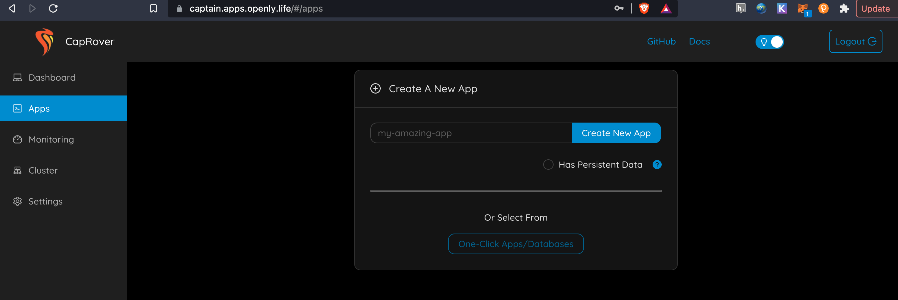
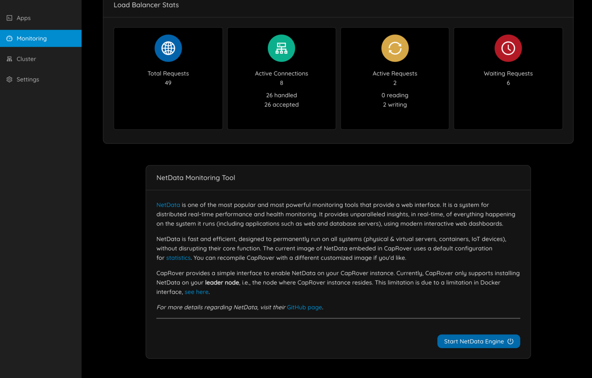

# CapRover


About CapRover

CapRover is an extremely easy to use app/database deployment & web server manager for your NodeJS, Python, PHP, ASP.NET, Ruby, MySQL, MongoDB, Postgres, WordPress (and etc...) applications!

It's blazingly fast and very robust as it uses Docker, nginx, LetsEncrypt and NetData under the hood behind its simple-to-use interface.

- CLI for automation and scripting
- Web GUI for ease of access and convenience
- No lock-in! Remove CapRover and your apps keep working!
- Docker Swarm under the hood for containerization and clustering
- Nginx (fully customizable template) under the hood for load-balancing
- Let's Encrypt under the hood for free SSL (HTTPS)

Caprover is a very cool management app for containers based on Docker Swarm.

It has following benefits :

- easy to deploy apps (in seconds)
- easy to create new apps
- super good monitoring
- can be extended over the TFGrid

## Requirements

- you need an account on TF-Chain, and there needs to be TFT on the account (see getting started)

<details><summary>How to Deploy
</summary>

- Choose one of the networks:
  -  https://play.dev.grid.tf for Devnet.
  -  https://play.qa.grid.tf for QAnet.
  -  https://play.test.grid.tf for Testnet.
  -  https://play.grid.tf for Mainnet.

<div class="card">
  
  <div class="container">
    <p>

- Login to your profile on the playground and select Caprover in the left side navigation menu
- The first thing you will need to configure is the Domain Name for your depployment
- This needs to be a domain you own as you will be using Wildcard Records in the DNS records
    </p>
  </div>
</div>

</details>

<details><summary>Deploying a Leader Node
</summary>

<div class="card">
  
  <div class="container">
    <h4><b>Deploying a leader node</b></h4>
    <p>

- Select a capacity package:
  - **Minimum**: {cpu: 1, memory: 1024, diskSize: 50 }
  - **Standard**: {cpu: 2, memory: 1024 * 2, diskSize: 100 }
  - **Recommended**: {cpu: 4, memory: 1024 * 4, diskSize: 250 }
  - Or choose a **Custom** plan

- Choose a node to deploy Caprover on.
- Either use the **Capacity Filter**. Which simply lets you pick a *Farm* and *Country*, after clicking on *Apply filters and suggest nodes* then it lists available nodes with these preferences and you pick.
	</p>
  </div>
</div>

</details>

<details><summary>Deploying a Worker Node
</summary>

<div class="card">
  
  <div class="container">
    <p>

- Click `Add` button to add a new worker.
- Select a capacity package:
  - **Minimum**: {cpu: 1, memory: 1024, diskSize: 50 }
  - **Standard**: {cpu: 2, memory: 1024 * 2, diskSize: 100 }
  - **Recommended**: {cpu: 4, memory: 1024 * 4, diskSize: 250 }
  - Or choose a **Custom** plan

- Choose a node to deploy Caprover on.
- Either use the **Capacity Filter**. Which simply lets you pick a *Farm* and *Country*, after clicking on *Apply filters and suggest nodes* then it lists available nodes with these preferences and you pick.

- Or use **Manual** and type a specific node number to deploy on.

Deployment will take couple of minutes.
	</p>
  </div>
</div>

</details>

<details><summary>How to Find my Deployments IP Address?
</summary>

<div class="card">
  
  <div class="container">
    <p>

Go back to your CapRover weblet and go to the deployment list. Click on `Show Details`.
- The public IPv4 address is visible in here
- Now you can configure the domain name (see above, don't forget to point the wildcard domain to the public IP address)

Click on details if you want to see more details

<details><summary>show complete json text</summary>

```json

{
    "version": 0,
    "name": "caprover_leader_cr_156e44f0",
    "created": 1637843368,
    "status": "ok",
    "message": "",
    "flist": "https://hub.grid.tf/samehabouelsaad.3bot/tf-caprover-main-a4f186da8d.flist",
    "publicIP": {
        "ip": "185.206.122.136/24",
        "gateway": "185.206.122.1"
    },
    "planetary": false,
    "yggIP": "",
    "interfaces": [
        {
            "network": "caprover_network_cr_156e44f0",
            "ip": "10.200.4.2"
        }
    ],
    "capacity": {
        "cpu": 4,
        "memory": 8192
    },
    "mounts": [
        {
            "name": "data0",
            "mountPoint": "/var/lib/docker",
            "size": 107374182400,
            "state": "ok",
            "message": ""
        }
    ],
    "env": {
        "SWM_NODE_MODE": "leader",
        "CAPROVER_ROOT_DOMAIN": "apps.openly.life",
        "PUBLIC_KEY": "ssh-rsa AAAAB3NzaC1yc2EAAAADAQABAAABAQC/9RNGKRjHvViunSOXhBF7EumrWvmqAAVJSrfGdLaVasgaYK6tkTRDzpZNplh3Tk1aowneXnZffygzIIZ82FWQYBo04IBWwFDOsCawjVbuAfcd9ZslYEYB3QnxV6ogQ4rvXnJ7IHgm3E3SZvt2l45WIyFn6ZKuFifK1aXhZkxHIPf31q68R2idJ764EsfqXfaf3q8H3u4G0NjfWmdPm9nwf/RJDZO+KYFLQ9wXeqRn6u/mRx+u7UD+Uo0xgjRQk1m8V+KuLAmqAosFdlAq0pBO8lEBpSebYdvRWxpM0QSdNrYQcMLVRX7IehizyTt+5sYYbp6f11WWcxLx0QDsUZ/J"
    },
    "entrypoint": "/sbin/zinit init",
    "metadata": "",
    "description": "caprover leader machine/node"
}
```
</summary>
</p>
  </div>
</div>


</details>

<details><summary>Setting your DNS records
</summary>

<div class="card">
  
  <div class="container">
    <p>

- e.g. I picked ```apps.openly.life``` which is a domain name that will point to the ip address of the CapRover instance (which we only know after deployment).	
> Note how the *.apps.openly.life points to the public IPv4 address that has been returned from the deployment.
	
   </p>
  </div>
</div>

</details>

<details><summary>how to add a new worker node to your cluster
</summary>

## Step 1: Add a default docker registry

<div class="card">
  
  <div class="container">
    <p>

You'll have to add a default docker registry so other CapRover nodes in the cluster can download images from, and it can be self-hosted (managed by CapRover itself), to add it, go to `Cluster` -> `Docker Registry Configuration`.
- Click `Add Self-Hosted Registry` button,
	</p>
  </div>
</div>

<div class="card">
  
  <div class="container">
    <p>

then click `Enable Self-Hosted Registry`
You can check [official documentation](https://caprover.com/docs/app-scaling-and-cluster.html#setup-docker-registry) to know more about Docker registry options.
	</p>
  </div>
</div>

## Step 2: Attach a new node to the cluster

<div class="card">
  
  <div class="container">
    <p>

- Add the public IPv4 address that has been returned from the worker deployment in the `New node IP Address` field.
- Add your `SSH private key` (you can use this command `cat ~/.ssh/id_rsa` to get your private key).
- Click `Join cluster` button.
	</p>
  </div>
</div>

</details>

<details><summary>Getting Started With Caprover
</summary>

## How to access the admin interface ?

<div class="card">
  
  <div class="container">
    <p>

- make sure your public IP address (in my case ```185.206.122.136```) is filled in in the domain name record.

> admin url: <https://captain.apps.openly.life/>   (note prefix captain, and the usage of our wildcard domain).
</br>
> The password is generated and visible behind the `Show Details` button of your CapRover deployment.
	</p>
  </div>
</div>

<div class="card">
  
  <div class="container">
    <p>
You should now see
	</p>
  </div>
</div>

## Step 1: Enable https

<div class="card">
  
  <div class="container">
    <p>
You will need to login and specify an email address in order to enable https
	</p>
  </div>
</div>

<div class="card">
  
  <div class="container">
    <p>

> Now force https.

You will have to login again, and you should notice https is now used.
	</p>
  </div>
</div>


## Step 2: Add a default docker registry

<div class="card">
  <div class="container">
    <p>You'll have to add a default docker registry so other CapRover nodes in the cluster can download images from, and it can be self-hosted (managed by CapRover itself), to add it, go to `Cluster` -> `Docker Registry Configuration`.</p>
  </div>
  
  <div class="container">
    <p>

You can check [official documentation](https://caprover.com/docs/app-scaling-and-cluster.html#setup-docker-registry) to know more about Docker registry options.	
    </p>
  </div>
</div>

## Step 3: Deploy an app

<div class="card">
  
  <div class="container">
    <p>just go to apps & follow the instructions, there is much more info on caprover website.</p>
  </div>
</div>

## Step 4: Enable monitoring

<div class="card">
  <div class="container">
    <p>Go to the monitoring tab and click the start monitoring button in the bottom right corner</P>
  </div>
  
</div>

Y<div class="card">
  <div class="container">
    <p>You should now see</p>
  </div>
  
</div>

## Step 5: Lets add nodes to caprover

<div class="card">
  <div class="container">
    <p>
- Go to the settings</p>
  </div>
  
  <div class="container">
    <p>

- Fill in your mnemonic from TF-Chain, make sure it's the right network you are connected to
- Set your store secret for storing deployment information securely on TF-Chain.
- Add your SSH-key
	</p>
  </div>
</div>

<div class="card">
  <div class="container">
    <p>

 Now go to `Cluster -> Deploy a new node on Threefold grid`, specify the details of the resources you need and then click **Search resources...** :</p>
  </div>
  
</div>

<div class="card">
  <div class="container">
    <p>

If there are enough resources, a new window will appear listing possible nodes to deploy this node to, select one of them and click **Deploy**:</p>
  </div>
  
</div>

<div class="card">
  <div class="container">
    <p>You should then see something like</p>
  </div>
  
  <div class="container">
    <p>

This should typically take less than 2 minutes.
> Important: the deployment process takes some time before it is known in CapRover.
Go out of the form and back to `Cluster`.
  </p>
  </div>
</div>

<div class="card">
  <div class="container">
    <p>

you can now exit out of the form and navigate back to to `Cluster`.</p>
  </div>
  
</div>

## Step 6: Change your password

- Go to `Settings` and change your password. This is important for your own security.

